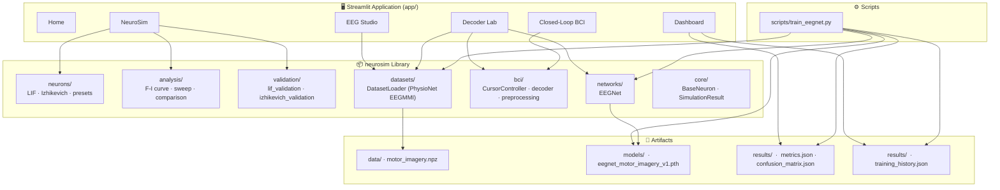
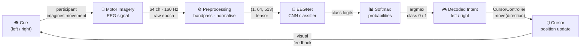
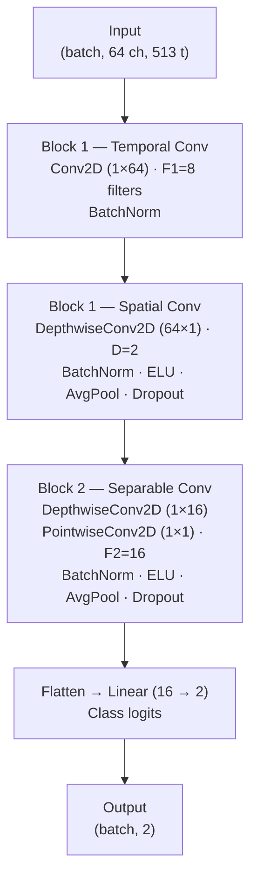

<div align="center">

# 🧠 NeuroLab

**An open-source computational neuroscience and brain-computer interface platform**

[](https://www.python.org/)
[](https://streamlit.io/)
[](https://pytorch.org/)
[](LICENSE)
[]()

[Features](#features) · [Architecture](#architecture) · [Installation](#installation) · [Usage](#usage) · [Modules](#modules) · [References](#scientific-references) · [Roadmap](#roadmap)

</div>

---

## Overview

NeuroLab is an interactive platform for learning, exploring, and experimenting with computational neuroscience and brain-computer interfaces. It combines a modular Python library (`neurosim`) with a multi-page Streamlit web application, letting researchers, students, and engineers move from spiking neuron simulation all the way through EEG signal analysis, deep learning decoding, and closed-loop BCI demonstration — in a single unified environment.

```
Neuron Simulation  ──►  EEG Analysis  ──►  Neural Decoding  ──►  Closed-Loop BCI
      ↑                                                                   │
      └──────────────────  Experiment Dashboard  ◄────────────────────────┘
```

---

## Motivation

Most neuroscience teaching tools cover either computational modelling **or** BCI signal processing — rarely both, and almost never in a way that connects them end-to-end. NeuroLab was built to close that gap:

- **Students** can build intuition for spiking neuron dynamics and see directly how those concepts relate to real EEG decoding.
- **Researchers** get a reproducible, scriptable analysis environment with clean Python APIs alongside an interactive UI.
- **Engineers** can explore the full BCI pipeline — from raw signal to decoded intent to output device — without needing specialist neuroscience infrastructure.

Everything runs locally on a laptop with no external services or special hardware.

---

## Features

### Computational Neuroscience
- **Leaky Integrate-and-Fire (LIF)** neuron model with configurable membrane time constant, resistance, and threshold
- **Izhikevich** neuron model implementing six published biological presets (Regular Spiking, Intrinsically Bursting, Chattering, Fast Spiking, Low-Threshold Spiking, Resonator)
- **F-I curve** analysis: firing rate as a function of injected current
- **Parameter sweep**: vary any scalar neuron parameter and observe the effect on spike statistics
- **Multi-model comparison**: simulate LIF and Izhikevich side-by-side with a shared summary table
- **Scientific validation suite**: automated pass/fail tests asserting model correctness against known behaviours

### EEG Signal Analysis
- Raw 64-channel EEG trial waveform viewer (PhysioNet EEGMMI dataset)
- **Power Spectral Density** (Welch's method, 0–40 Hz)
- **Spectrogram** (STFT, logarithmic power scale, Viridis colormap)
- **Frequency band power**: δ, θ, α, β, γ (trapezoidal integration, bar chart + table)

### Neural Decoding
- **EEGNet**: a compact depthwise-separable CNN for motor imagery classification (left vs. right hand)
- Per-trial inference with class probability distribution
- Model evaluation: accuracy, precision, recall, F1 (macro), confusion matrix
- Training curve visualisation (validation accuracy & loss per epoch)

### Closed-Loop BCI
- Structured session demo: configurable trial count and decoder accuracy
- Balanced left/right cue presentation with seeded random shuffle
- Per-trial cue display, mock prediction, confidence score, and match/mismatch indicator
- Session accuracy tracking and per-trial result history
- Virtual 2D cursor driven by decoded movement intent

### Experiment Dashboard
- Unified overview of all modules and results in a single view
- Key metrics panel (accuracy, F1, precision, recall) loaded from saved artifacts
- Training curve sparkline and confusion matrix mini-chart
- Live closed-loop session stats via shared session state

---

## Architecture

### Platform Architecture



### BCI Pipeline



### EEGNet Architecture



> Architecture follows Lawhern et al. (2018). Parameter count: ~2,500 trainable weights.

---

## Installation

### Prerequisites

| Requirement | Version |
|---|---|
| Python | ≥ 3.11 |
| pip | ≥ 23 |
| (optional) PyTorch | ≥ 2.0 |

### Clone and install

```bash
git clone https://github.com/ceciliaj19/neurosim-bci-platform.git
cd neurosim-bci-platform

# Create and activate a virtual environment (recommended)
python -m venv .venv
source .venv/bin/activate      # macOS / Linux
# .venv\Scripts\activate       # Windows

# Install core dependencies
pip install -e .

# Install training dependencies (required for EEGNet)
pip install -e ".[training]"
```

### Dependencies

**Core** (installed automatically):

| Package | Purpose |
|---|---|
| `numpy` | Numerical arrays and simulation |
| `scipy` | Signal processing (Welch, spectrogram) |
| `matplotlib` | Offline plots and training artifacts |
| `pandas` | Analysis result DataFrames |
| `streamlit` | Web application framework |
| `plotly` | Interactive charts |

**Optional** (`pip install -e ".[training]"`):

| Package | Purpose |
|---|---|
| `torch ≥ 2.0` | EEGNet training and inference |
| `scikit-learn` | Confusion matrix and evaluation metrics |

---

## Usage

### Run the web application

```bash
streamlit run app/app.py
```

The app opens at `http://localhost:8501`. Navigate between modules using the sidebar.

### Train EEGNet

```bash
python scripts/train_eegnet.py
```

This trains EEGNet on the bundled PhysioNet EEGMMI dataset and writes the following artifacts:

```
models/
└── eegnet_motor_imagery_v1.pth     # Trained checkpoint

results/
├── metrics.json                    # Accuracy, F1, precision, recall
├── confusion_matrix.json           # Raw confusion matrix (labels + matrix)
├── confusion_matrix.png            # Visual confusion matrix
├── training_history.json           # Per-epoch train/val loss and accuracy
└── training_curve.png              # Training curve plot
```

### Use the Python API

```python
from neurosim.neurons import LIFNeuron, IzhikevichNeuron, get_izhikevich_preset
from neurosim.analysis import compute_fi_curve, parameter_sweep, compare_neuron_models
import numpy as np

# --- LIF neuron: F-I curve ---
lif = LIFNeuron(tau_m=20.0, resistance=10.0, v_threshold=-55.0)
currents = np.linspace(0, 5, 20)
fi_df = compute_fi_curve(lif, currents, t_max=500.0)
print(fi_df.head())
#    current  firing_rate  spike_count
# 0     0.00          0.0            0
# 1     0.26          0.0            0
# ...

# --- Izhikevich presets ---
preset = get_izhikevich_preset("chattering")
iz = IzhikevichNeuron(a=preset.a, b=preset.b, c=preset.c, d=preset.d)
result = iz.simulate(current=10.0, duration=500.0)
print(f"Spike count: {len(result.spike_times)}")

# --- Model comparison ---
neurons = {"LIF": lif, "Izhikevich RS": IzhikevichNeuron()}
results, summary = compare_neuron_models(neurons, current=2.0, t_max=500.0)
print(summary)

# --- Parameter sweep ---
sweep_df = parameter_sweep(lif, "tau_m", np.linspace(5, 50, 10), current=2.0)
print(sweep_df)
```

---

## Modules

### Screenshots

> **Note:** Screenshot placeholders are provided below. Replace each path with an actual screenshot once the app is running.

#### 🏠 Home


_The home page introduces the platform with an overview of each module and a quick-start workflow._

---

#### 🧪 NeuroSim


_Interactive single-neuron simulation with LIF and Izhikevich models. Includes F-I curve, parameter sweep, model comparison, and Izhikevich preset explorer._

---

#### 📡 EEG Studio


_Raw 64-channel EEG waveform viewer with power spectral density, spectrogram, and frequency band power analysis._

---

#### 🤖 Decoder Lab


_EEGNet inference on individual EEG trials, with class probability visualisation, model performance metrics, and confusion matrix._

---

#### 🎮 Closed-Loop BCI


_Session-style BCI demo: left/right cue presentation, mock probabilistic decoder, per-trial match/mismatch feedback, cursor trajectory, and session accuracy tracking._

---

#### 📊 Experiment Dashboard


_Unified overview of all modules: key metrics KPI panel, training curve, confusion matrix, live closed-loop session stats._

---

### Module API Reference

#### `neurosim.neurons`

| Symbol | Description |
|---|---|
| `LIFNeuron` | Leaky Integrate-and-Fire neuron model |
| `IzhikevichNeuron` | Izhikevich spiking neuron model |
| `IzhikevichPreset` | Frozen dataclass holding preset parameters |
| `get_izhikevich_preset(name)` | Look up a preset by name (case-insensitive) |
| `list_izhikevich_presets()` | Return all available preset names |

**Izhikevich presets:**

| Preset | a | b | c | d | Behaviour |
|---|---|---|---|---|---|
| Regular Spiking | 0.02 | 0.2 | −65 | 8 | Tonic firing; most common cortical neuron type |
| Intrinsically Bursting | 0.02 | 0.2 | −55 | 4 | Initial burst then tonic spiking |
| Chattering | 0.02 | 0.2 | −50 | 2 | High-frequency bursts of spikes |
| Fast Spiking | 0.1 | 0.2 | −65 | 2 | Rapid tonic firing without adaptation |
| Low-Threshold Spiking | 0.02 | 0.25 | −65 | 2 | Rebound burst after hyperpolarisation |
| Resonator | 0.1 | 0.26 | −65 | −1 | Subthreshold oscillations; frequency selectivity |

#### `neurosim.analysis`

| Function | Returns | Description |
|---|---|---|
| `compute_fi_curve(neuron, currents, t_max, dt)` | `pd.DataFrame` | Firing rate vs. injected current |
| `parameter_sweep(neuron, param, values, current, t_max, dt)` | `pd.DataFrame` | Spike statistics across a parameter range |
| `compare_neuron_models(neurons, current, t_max, dt)` | `(dict, pd.DataFrame)` | Simulate multiple models, return results and summary |

#### `neurosim.validation`

| Function | Returns | Description |
|---|---|---|
| `validate_lif()` | `pd.DataFrame` | Run LIF correctness assertions |
| `validate_izhikevich()` | `pd.DataFrame` | Run Izhikevich correctness assertions |

Results DataFrame columns: `test`, `expected_behavior`, `observed_behavior`, `passed`.

---

## Repository Structure

```
neurosim-bci-platform/
│
├── app/                          # Streamlit application
│   ├── app.py                    # Entry point (set_page_config + home render)
│   ├── pages/
│   │   ├── home.py               # Landing page
│   │   ├── neurosim.py           # Neuron simulation and analysis
│   │   ├── eeg_studio.py         # EEG signal visualisation
│   │   ├── decoder_lab.py        # EEGNet inference and evaluation
│   │   ├── closed_loop.py        # Closed-loop BCI session demo
│   │   ├── dashboard.py          # Experiment Dashboard
│   │   └── tutorials.py          # Guided tutorials
│   └── components/
│       ├── page_header.py        # Shared branded header component
│       ├── eeg_chart.py          # Multi-channel EEG waveform chart
│       ├── cursor_chart.py       # 2D cursor trajectory chart
│       └── model_metrics.py      # Model metrics sidebar component
│
├── neurosim/                     # Python library (installable)
│   ├── core/
│   │   ├── base_neuron.py        # BaseNeuron ABC and SimulationResult
│   │   └── result.py
│   ├── neurons/
│   │   ├── lif.py                # Leaky Integrate-and-Fire
│   │   ├── izhikevich.py         # Izhikevich model
│   │   └── izhikevich_presets.py # Six published biological presets
│   ├── analysis/
│   │   ├── fi_curve.py           # compute_fi_curve()
│   │   ├── parameter_sweep.py    # parameter_sweep()
│   │   ├── model_comparison.py   # compare_neuron_models()
│   │   └── _types.py             # _Simulatable protocol
│   ├── validation/
│   │   ├── lif_validation.py     # validate_lif()
│   │   └── izhikevich_validation.py
│   ├── networks/
│   │   └── eegnet.py             # EEGNet CNN (Lawhern et al. 2018)
│   ├── bci/
│   │   ├── cursor.py             # CursorController
│   │   ├── decoder.py            # BCI decoder interface
│   │   └── preprocessing.py      # EEG preprocessing utilities
│   └── datasets/
│       └── loader.py             # DatasetLoader (PhysioNet EEGMMI)
│
├── scripts/
│   └── train_eegnet.py           # EEGNet training pipeline
│
├── data/
│   └── motor_imagery/
│       └── multisubject_motor_imagery.npz  # Preprocessed EEG dataset
│
├── models/
│   └── eegnet_motor_imagery_v1.pth         # Trained checkpoint
│
├── results/
│   ├── metrics.json              # Evaluation metrics
│   ├── confusion_matrix.json     # Test-set confusion matrix
│   ├── confusion_matrix.png
│   ├── training_history.json     # Per-epoch train/val statistics
│   └── training_curve.png
│
├── docs/
│   ├── bci-architecture.md
│   ├── design-decisions.md
│   ├── product-spec.md
│   └── scientific-foundation/
│       ├── README.md
│       ├── bibliography.md
│       ├── neurons/
│       ├── bci/
│       └── datasets/
│
├── examples/
│   └── lif_demo.py               # Standalone LIF simulation example
│
├── tests/
│   └── test_lif.py
│
├── pyproject.toml
├── requirements.txt
├── ROADMAP.md
└── LICENSE
```

---

## Dataset

NeuroLab uses the **PhysioNet EEG Motor Movement/Imagery Dataset (EEGMMI)**:

- **Subjects:** 109 subjects
- **Channels:** 64 EEG electrodes
- **Sampling rate:** 160 Hz
- **Paradigm:** Motor imagery — imagined left-hand vs. right-hand movement
- **Trials per subject:** ~45 (balanced binary classes)
- **Format:** Preprocessed into `.npz` (NumPy arrays) for offline use

> Goldberger AL, et al. (2000). PhysioBank, PhysioToolkit, and PhysioNet. *Circulation*, 101(23):e215–e220. DOI: [10.1161/01.CIR.101.23.e215](https://doi.org/10.1161/01.CIR.101.23.e215)

---

## Scientific References

### Neuron Models

**Izhikevich (2003)**
Izhikevich, E. M. (2003). Simple model of spiking neurons. *IEEE Transactions on Neural Networks*, 14(6), 1569–1572. DOI: [10.1109/TNN.2003.820440](https://doi.org/10.1109/TNN.2003.820440)

> Source for all six Izhikevich presets implemented in `izhikevich_presets.py`. Parameter values (a, b, c, d) are taken directly from Table 1 of this paper.

**Burkitt (2006)**
Burkitt, A. N. (2006). A review of the integrate-and-fire neuron model: I. Homogeneous synaptic input. *Biological Cybernetics*, 95(1), 1–19.

> Foundational review of the LIF model used in `lif.py`.

### EEG and BCI Decoding

**Lawhern et al. (2018)**
Lawhern, V. J., Solon, A. J., Waytowich, N. R., Gordon, S. M., Hung, C. P., & Lance, B. J. (2018). EEGNet: A compact convolutional neural network for EEG-based brain-computer interfaces. *Journal of Neural Engineering*, 15(5), 056013. DOI: [10.1088/1741-2552/aace8c](https://doi.org/10.1088/1741-2552/aace8c)

> Architecture reference for `neurosim/networks/eegnet.py`. Temporal filtering → depthwise spatial filtering → separable convolution design.

**Pfurtscheller & Neuper (2001)**
Pfurtscheller, G., & Neuper, C. (2001). Motor imagery and direct brain-computer communication. *Proceedings of the IEEE*, 89(7), 1123–1134.

> Foundational work on event-related desynchronisation (ERD) and motor imagery paradigms underlying the EEG analysis in EEG Studio.

### Dataset

**Goldberger et al. (2000)**
Goldberger, A. L., Amaral, L. A., Glass, L., Hausdorff, J. M., Ivanov, P. C., Mark, R. G., … & Stanley, H. E. (2000). PhysioBank, PhysioToolkit, and PhysioNet: Components of a new research resource for complex physiologic signals. *Circulation*, 101(23), e215–e220. DOI: [10.1161/01.CIR.101.23.e215](https://doi.org/10.1161/01.CIR.101.23.e215)

**Schalk et al. (2004)**
Schalk, G., McFarland, D. J., Hinterberger, T., Birbaumer, N., & Wolpaw, J. R. (2004). BCI2000: A general-purpose brain-computer interface (BCI) system. *IEEE Transactions on Biomedical Engineering*, 51(6), 1034–1043.

---

## Roadmap

| Version | Goal | Status |
|---|---|---|
| **v0.1** | LIF neuron + Streamlit app | ✅ Complete |
| **v0.2** | Analysis tools (F-I, parameter sweep, comparison) | ✅ Complete |
| **v0.3** | Izhikevich model + presets + validation | ✅ Complete |
| **v0.4** | EEG Studio (PSD, spectrogram, band power) | ✅ Complete |
| **v0.5** | EEGNet training pipeline + Decoder Lab | ✅ Complete |
| **v0.6** | Closed-Loop BCI session demo | ✅ Complete |
| **v0.7** | Experiment Dashboard | ✅ Complete |
| **v0.8** | Hodgkin-Huxley neuron model | 🔲 Planned |
| **v0.9** | Small network simulation (E/I circuits, raster plots) | 🔲 Planned |
| **v1.0** | Public release: tutorial notebooks, test coverage, deploy | 🔲 Planned |

### Upcoming features (post v0.7)

- **Hodgkin-Huxley model** — full conductance-based simulation with Na⁺, K⁺, leak channels
- **Network simulation** — excitatory/inhibitory populations, synaptic connections, spike raster plots
- **Common Spatial Patterns (CSP)** — classical spatial filtering for motor imagery classification
- **Online training mode** — retrain EEGNet from the UI with configurable hyperparameters
- **Multi-subject dataset explorer** — per-subject decoding accuracy breakdown
- **Tutorial notebooks** — Jupyter notebooks walking through each module with explanations
- **Streamlit Cloud deployment** — one-click public demo

---

## Contributing

Contributions are welcome. Please open an issue before starting a large feature so it can be discussed first.

```bash
# Fork and clone
git clone https://github.com/your-username/neurosim-bci-platform.git
cd neurosim-bci-platform

# Install in editable mode with dev dependencies
pip install -e ".[training]"

# Run tests
python -m pytest tests/

# Start the app locally
streamlit run app/app.py
```

---

## License

This project is licensed under the **MIT License** — see [LICENSE](LICENSE) for details.

---

<div align="center">

Built by [ceciliaj19](https://github.com/ceciliaj19) · Computational Neuroscience & BCI · 2026

</div>
